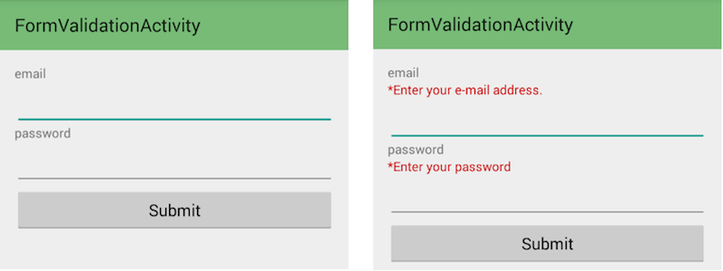

rxandroid-usecase
=================

RxJavaとかRxAndroidよくわからないので、よくある要求に対してRxAndroidを使って実装するとどうなるかを試すリポジトリです。

I don't understand RxJava or RxAndroid yet. I'll implement typical case of Android, using RxAndroid. (+o+)


## environment

Will change rapidly...

- Groovy 2.4.0-beta-3
- rxandroid 0.22.0
- multidex 1.0.0
- swissknife 1.1.4
- greenbot/EventBus 2.4.0


## Form Validation


### require

emailとpasswordを入力するフォームがある。submitボタンを押した時、それぞれのフォームの空チェックを行い、エラーの場合送信を中止し、エラー表示を行う。



### implement

```groovy
@InjectView(R.id.edit_email)
EditText email;

@InjectView(R.id.text_email_error)
TextView emailError;

@InjectView(R.id.edit_password)
EditText password;

@InjectView(R.id.text_password_error)
TextView passwordError;

@InjectView(R.id.buttom_submit)
Button submit;

@Override
protected void onCreate(Bundle savedInstanceState) {
  super.onCreate(savedInstanceState);
  setContentView(R.layout.activity_form_validation);
  SwissKnife.inject(this)
  ViewObservable.clicks(submit)
          .map(
          { event ->
            return validateEmpty(email,
                hideError(emailError),
                showError(emailError, "*Enter your e-mail address.")
            )
          })
          .map(
          { Boolean isValid ->
            return validateEmpty(password,
                hideError(passwordError),
                showError(passwordError, "*Enter your password")
            ) && isValid
          })
          .filter(
          { Boolean isValid ->
            isValid
          })
          .subscribe(
          { Boolean isValid ->
            //do submit
          })
}
```

validation method and closures.

```groovy
def static Closure<Void> hideError(TextView errorView) {
  return {
    errorView.setVisibility(View.GONE)
  }
}

def static Closure<Void> showError(TextView errorView, String message) {
  return {
    errorView.setText(message)
    errorView.setVisibility(View.VISIBLE)
  }
}

def static boolean validateEmpty(EditText editText, Closure hideError, Closure showError) {
  String text = editText.getText().toString()
  if (TextUtils.isEmpty(text)) {
    showError.call()
    return false
  }
  hideError.call()
  return true
}
```


## Simple Network Access

TODO

## Rss Parse

TODO

## Form validation 2

TODO

## ListView paging

TODO

## View Binding

TODO

## RxAndroid in Fragment

TODO
    
                

## LICENSE

```
Copyright 2014 Toshihiro Yagi.

Licensed under the Apache License, Version 2.0 (the "License");
you may not use this file except in compliance with the License.
You may obtain a copy of the License at

   http://www.apache.org/licenses/LICENSE-2.0

Unless required by applicable law or agreed to in writing, software
distributed under the License is distributed on an "AS IS" BASIS,
WITHOUT WARRANTIES OR CONDITIONS OF ANY KIND, either express or implied.
See the License for the specific language governing permissions and
limitations under the License.
```